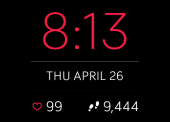
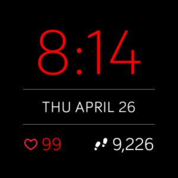
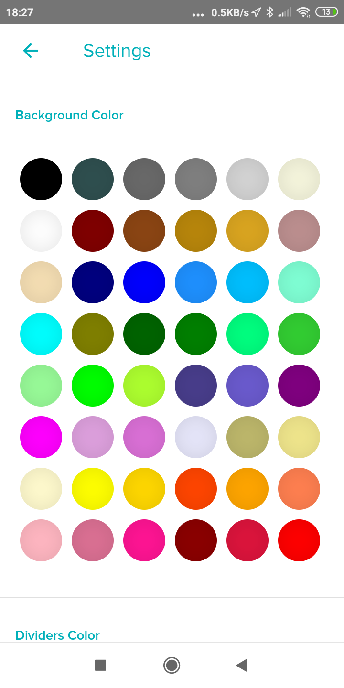
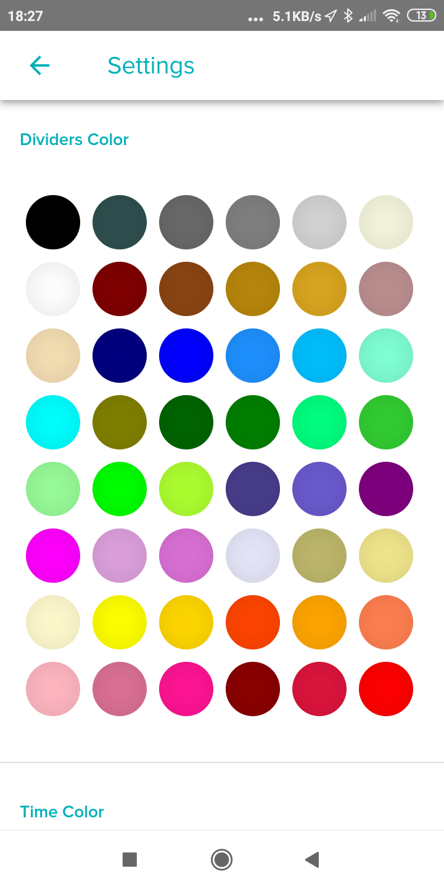
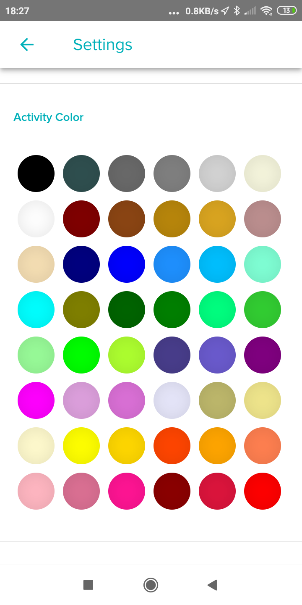
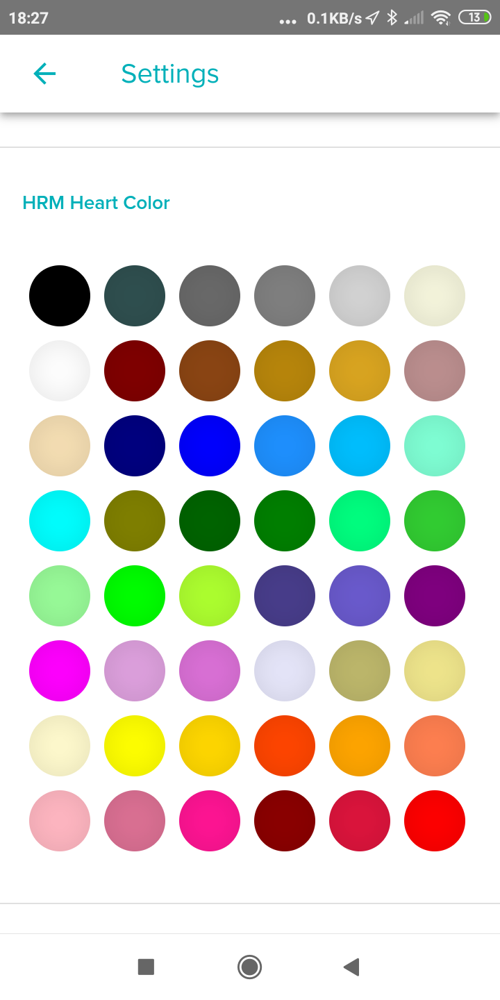

# sdk-moment

SDK example version of the "Moment" clock face by Fitbit.

This is intended to be used as an example for building clock faces. Do not
re-use the visual design, we don't need 100's of clocks in the gallery with the
same design!

### Screenshots (Watch/Tracker)

|	**fitbit Ionic**				|	**fitbit Versa**				|	**Mobile APP Settings**											|
|-----------------------------------|-----------------------------------|:-----------------------------------------------------------------:|
| 	|  |<kbd>	 </kbd>	|

---

  
Click to see all Mobile APP Settings screens

|	**Part 2**							| **Part 3**							|**Part 4**								|
|:-------------------------------------:|:-------------------------------------:|:-------------------------------------:|
|   		|   		|			|
|				**Part 5**				| 			**Part 6**								|**Part 7**					|
|   		|   		|			|

